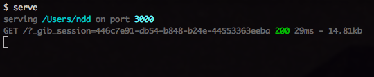

XSS 1 - Session jacking!
------------------------

In this chapter we are going to practice **Stored Cross Site Scripting** attacks (or, as it is most commonly called, Stored XSS) to steal the users' session.

To start, try to understand what the *session* is. How does the system know you are logged in? `Charles` might help you in this case.

.. 

.

### Read some stuff

Now, I recommend that you to read what [OWASP has to say about XSS](https://www.owasp.org/index.php/Cross-site_Scripting_%28XSS%29).

Did you read it? so fast? no no no, click on the link and educate yourself!

.. 

### Practice some stuff

Now, when this is out of the way, try [prompt.ml](http://prompt.ml/). It's a nice service that will teach you how the script injection actually works. (The first level is fairly easy, but it gets really complicated really fast.)

### XSS attack breakdown

1. **the attacker** send a message with a malicious script in it.
2. **the victim** reads the message, and the scripts executes in the background without the user's knowledge.
3. the script sends **the victim's** cookies to **the attacker's** machine.
4. **the attacker** uses the cookie to log into the system posing as **the victim**.

### Hack some stuff

Cool, now for the fun stuff, you are going to use your newly acquired knowledge to post a malicious message on Gibson's wall. This message will send the victim's session to your `serve` application, which is running on the attacker's machine.

#### Hint
> Try to get the data stored in `document.cookie` and use `$.get()` (create a get request) function to send it to the `serve` application on `http://attacker.com:3000`.

If you did it right you should end up with something like this:

From this point you need to use some of your imagination!

You can consider yourself successful once you've posted a message in the victim's name.

- - - 
#### One you've managed to post a message through the victim's account:
[Move on to play defence!](03-XSS1-defence.md)